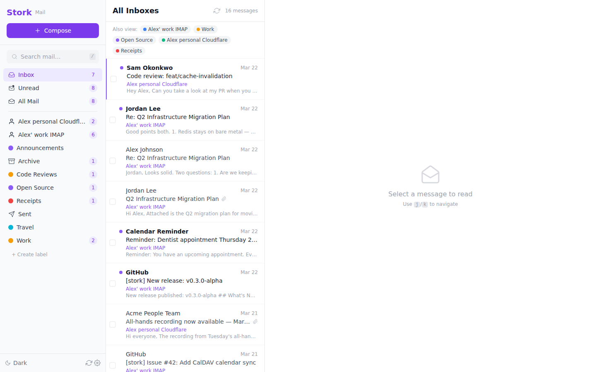
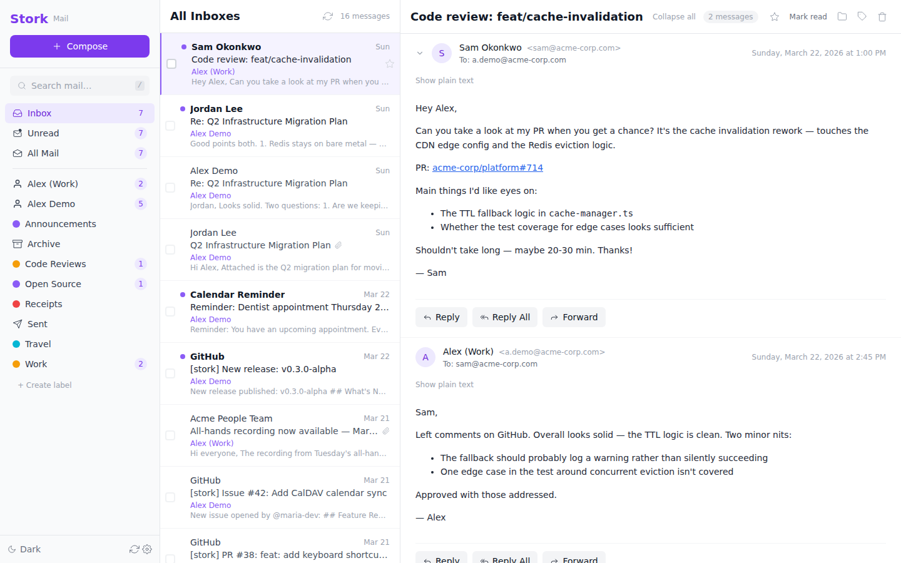
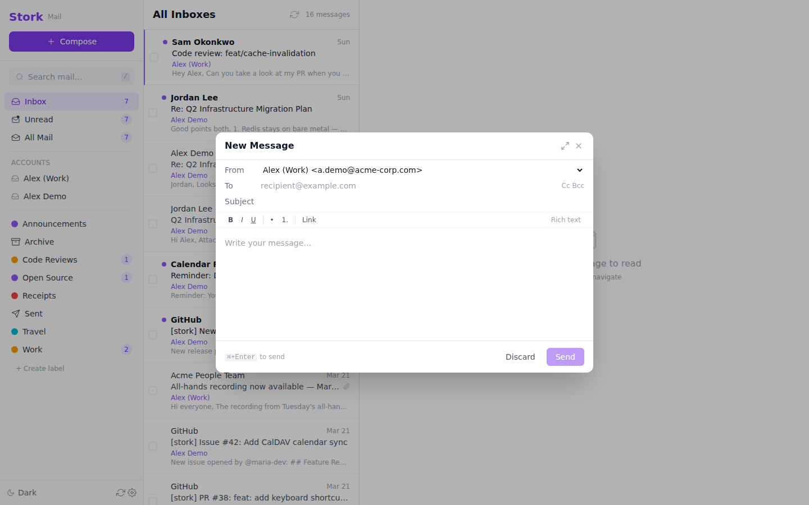

[](https://github.com/paperkite-hq/stork/actions/workflows/ci.yml)
[](https://github.com/paperkite-hq/stork/actions/workflows/ci.yml)
[](LICENSE)

# Stork

**Self-hosted email client with encrypted local storage, IMAP sync, and full-text search.**

> Self-host the client, not the edge.



Stork syncs your email from any IMAP server, stores it locally with **AES-256 encryption at rest**, full-text search, and a modern web interface. Keep using your existing mail server for sending and receiving — Stork handles storage, search, and the UI.

- **Encryption at rest** — AES-256 via SQLCipher. Container boots locked; your password unlocks it.
- **Sync from any IMAP server** — Mailcow, Dovecot, Fastmail, whatever you've got
- **Full-text search** — FTS5-powered search across your entire mailbox, instantly
- **Compose & send** — reply, reply-all, forward, and compose via your SMTP server
- **Labels, not folders** — Gmail-style labels replace rigid folder hierarchies ([why?](docs/design-decisions.md))
- **Recovery key** — 24-word BIP39 mnemonic so a forgotten password doesn't mean lost mail
- **Single container** — `docker compose up` and you're running. No PHP, no external DB.

## Quick Start

```yaml
# docker-compose.yml
services:
  stork:
    image: ghcr.io/paperkite-hq/stork:latest
    init: true
    ports:
      - "127.0.0.1:3100:3100"
    volumes:
      - stork-data:/app/data
    restart: unless-stopped

volumes:
  stork-data:
```

```bash
docker compose up -d
# Open http://localhost:3100
```

The setup wizard will guide you through creating a password and connecting your email account. See the [Getting Started guide](docs/getting-started.md) for a full walkthrough.

<details>
<summary>Docker run (single command)</summary>

```bash
docker run -d --init \
  -p 127.0.0.1:3100:3100 \
  -v ~/stork-data:/app/data \
  --memory-swappiness=0 \
  --ulimit core=0 \
  --security-opt no-new-privileges \
  --restart unless-stopped \
  ghcr.io/paperkite-hq/stork:latest
```

Binds to localhost only, stores the encrypted database in `~/stork-data`, disables swap/core dumps/privilege escalation.
</details>

<details>
<summary>Build from source</summary>

```bash
git clone https://github.com/paperkite-hq/stork.git
cd stork
docker compose up --build
```
</details>

## Screenshots

**Threaded conversations** — messages grouped by thread with expand/collapse, reply, reply-all, and forward:



**Compose** — clean compose form with keyboard shortcut to send:



## How Stork Compares

| | Stork | Roundcube | Bichon | Mailu |
|---|---|---|---|---|
| **What it is** | Email client | Webmail client | Email archiver | Full mail server |
| **Deployment** | Docker (single container) | PHP + web server + DB | Docker / binary | Docker (multi-container) |
| **Encryption at rest** | ✅ AES-256 SQLCipher | ❌ | ❌ | ❌ |
| **Local storage** | ✅ SQLite | ✅ MySQL/PostgreSQL | ✅ EML files + Tantivy | ✅ (full server) |
| **Full-text search** | ✅ FTS5 (fast, indexed) | ⚠️ basic | ✅ Tantivy | ✅ Solr |
| **Web UI** | ✅ React | ✅ jQuery | ✅ React | ✅ (Roundcube/Rainloop) |
| **Label-based org** | ✅ | ❌ (folders only) | ❌ | ❌ (folders only) |
| **Compose/send** | ✅ SMTP | ✅ | ❌ (read-only) | ✅ (full MTA) |
| **Recovery key** | ✅ BIP39 mnemonic | ❌ | ❌ | ❌ |
| **Self-contained** | ✅ (no PHP, no extra DB) | ❌ | ✅ | ❌ (many services) |

**Roundcube** is the most mature option with the deepest plugin ecosystem — better for calendar integration or multi-user shared hosting. **Bichon** is focused on email archiving — better for long-term preservation of large mailboxes. **Mailu** is a complete mail server stack — use it if you need to replace your mail infrastructure entirely. Stork is a client that connects to your existing server.

## Roadmap

- [x] IMAP sync engine (incremental, resumable)
- [x] SQLite storage with FTS5 full-text search
- [x] SMTP sending via configured server
- [x] Web UI — inbox, threads, compose, search
- [x] Docker single-container deployment
- [x] Label-based organization (Gmail-style)
- [x] Encryption at rest (AES-256 via SQLCipher, BIP39 recovery key)
- [ ] Pluggable connector architecture
- [ ] Delete-from-server workflow
- [ ] Multi-account support

## Documentation

- **[Getting Started](docs/getting-started.md)** — first launch, encryption setup, adding an account
- **[User Guide](docs/user-guide.md)** — search tips, backups, reverse proxy
- **[Use Cases](docs/use-cases.md)** — encrypted Gmail backup, Mailcow replacement, VPN access
- **[Configuration](docs/configuration.md)** — environment variables, Docker options
- **[API Reference](docs/api.md)** — REST API documentation
- **[Architecture](docs/architecture.md)** — system design and codebase walkthrough
- **[Design Decisions](docs/design-decisions.md)** — labels over folders, and why
- **[FAQ](docs/faq.md)** — common questions about sync, search, and data safety
- **[Contributing](CONTRIBUTING.md)** — development setup, running tests

## Development

```bash
npm install
npm run dev    # Start dev server
npm test       # Run tests
npm run lint   # Lint
```

## Tech Stack

[Node.js](https://nodejs.org) 22+ · [Hono](https://hono.dev) · SQLite/[SQLCipher](https://www.zetetic.net/sqlcipher/) · [FTS5](https://www.sqlite.org/fts5.html) · [ImapFlow](https://github.com/postalsys/imapflow) · [Nodemailer](https://nodemailer.com) · React · Tailwind CSS · Vite

## License

AGPL-3.0 — see [LICENSE](LICENSE) for details.

Paperkite Technologies LLC retains the right to offer Stork under alternative license terms (e.g., a commercial license for hosted deployments).
